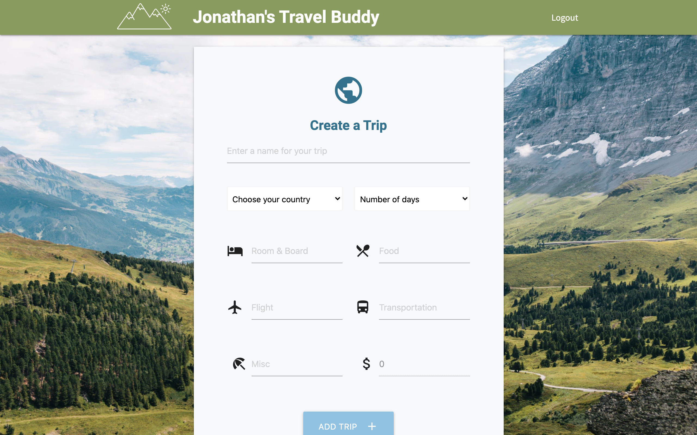
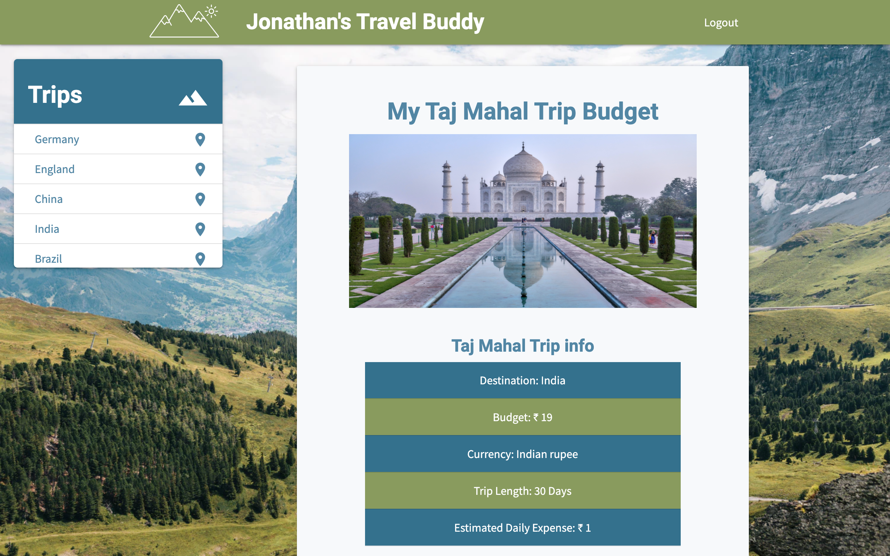

# Travel-Buddy

Travel Buddy -- Project 3 for DU Coding Bootcamp

## Getting Started

Link to heroku deployment:

## Team Members

- Sammy Sloan (@slsloan)
- Will Hitch (@willhitch)
- Jon Tousley (@Jtousley999)

## Project Description

### Overview

For project three we were tasked at building an app using MERN stack. We decided on a travel budgetting app that allowed the user to create a profile that they could add new trips to.

```
AS A traveler with a limited budget
I WANT to be able to track the trips I got on
SO THAT I can keep things organized
```






### Technology/Framework:

- HTML / CSS / JAVASCRIPT
- jQuery / AJAX
- NPM / express / MongoDB / mongoose / dotenv / nodemon
- Reactjs / React-Router
- Materialize (https://materilizecss.com/)
- Heroku

## Acknowledgments

- Logo and Favicon created by Ricky Stewart
